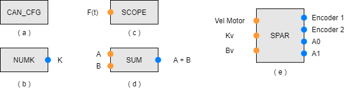
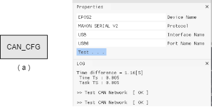
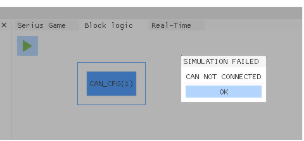
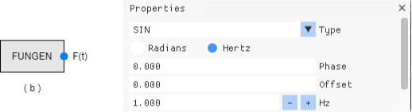
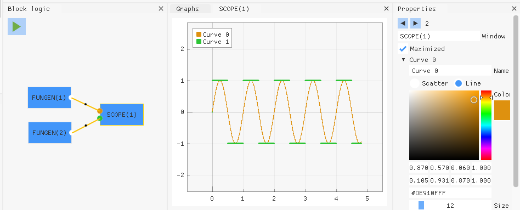
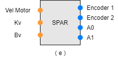
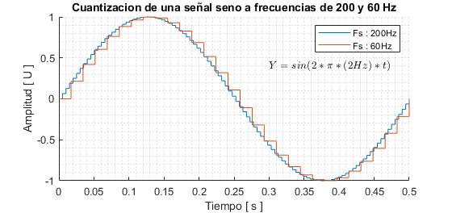
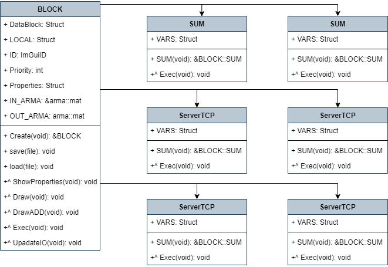

<style>
    figure{
        background-color: rgba(255,255,255,.4);
        color: black;
    };
</style>

# Tipos de bloques

Debido a la complejidad del sistema e algunos factores de ejecucion, y modelo gráfico podemos categorizar los bloques de diferentes maneras, ya sea por el numero de entradas y salidas presentes, por su prioridad al momento de ejecutar, o su modo de funcionamiento.

## Numero de entradas y salidas

De acuerdo a este factor podemos encontrar 5 tipos de bloques, que varian desde ninguna interfaz de entrada o salida **(E/S)**, hasta entradas y salidas personalizadas.

<figure align="center">
     <br>
    <figcaption>Fig.1 Categorizacion de bloques por numero de entradas.</figcaption>
</figure>

* Bloques tipo *a*, o independientes.
  
  Estos bloques nunca están ligados a otros bloques. Entonces, Cúal es su función?, principalmente es de establecer configuraciones iniciales y finales del conjunto, es decir, a nivel de red, establecer un proxy, a nivel fisico, definir puertos, a nivel de maquina, verificar que existan algunos parametros o archivos necesarios, en otras palabras, son Scripts personalizados, aquí podemos verificar errores, antes de ejecutar el sistema por completo, y así evitar problemas o situaciones no deseadas.

  En la figura 2 podemos ver el bloque de configuracion de la red CAN, **CAN_CFG**, donde se establece el puerto físico donde se pretende, esté conectada las *EPOS*.
  Tambien posse un boton de test, para validar estas configuraciones.

    <figure align="center">
         <br> 
        <figcaption>Fig.2 BLoque encargado de la configuracion CAN.</figcaption>
    </figure>

  En determinado caso que la ejecucion inicie y ocurra un fallo es posible programar el comportamiento del programa, como buscar posibles soluciones o simpleente detener la ejecucion, como es mostrado en la figura 3.

    <figure align="center">
         <br> 
        <figcaption>Fig.3 Mensaje de error controlado por el bloque <i>CAN_CGF</i></figcaption>
    </figure>

* Bloques tipo *b*, o fuentes.
  
  Estos tipos de bloques son de gran utilidad al momento de encontrar la mejor ruta de ejecucion del sistema completo, pues aquí es donde se establece un punto de partida, debido a que este tipo de bloque no posee ningun requerimiento, es facil determinar que son ellos quienes se ejecutarán de primera medida.
    
    <figure align="center">
         <br> 
        <figcaption>Fig.4 Bloque FUNGEN y sus propiedades <i>CAN_CGF</i></figcaption>
    </figure>

  Como observamos en la figura 4, podemos determinar algunas propiedades de los bloques, para definir su funcionamiento, en este caso es un generador de funciones, donde podemos determinar la forma de la onda, y propiedades como la frecuencia , y el desfase en tiempo y amplitud.

* Bloques tipo *c*, o sumideros.

    Al igual que los bloques de tipo **a** son de gran importancia al momento de encontrar un camino óptimo, pues como sabemos que no es requisito de ningun bloque, podemos asegurar que estos bloques se ejecutarán al final de cada iteracion. 

    En la imagen 5, vemos un ejemple básico donde dos funciones son generadas y mostradas en una ventana, cada bloque sumidero pude poseer propiedades, como en este caso es posible determinar cuantas entradas va a tener, los nombres de cada una de ellas, los colores, el tipo de gráfico y el ancho de linea.
  
    <figure align="center">
         <br> 
        <figcaption>Fig.5 Simulacion simple, generar dos funciones y mostrarlas en un gráfico.</figcaption>
    </figure>

    Otro ejemplo de sumidero puede ser un bloque encargado de crear un DataLog, que tome como entrada una variable o un vector y lo almacene en un documento de texto, como se es de esperar el valor de dicha variable debe ser generado antes para poder almacenarlo, y en sus propiedades puede tener el nombre del fichero a crear y su ubicacion, si es un vector, separarado por comas, espacios o tabulaciones.

* Bloques tipo *d*, o intermedios.

    Cómo su nombre lo dice, son intermedios, es decir al momento de ejecucion dependen de alguien previo y a su vez alguien más depende de ellos para crear la secuendia, uno de los bloques más usados en este tipo es el mostrado en la figura 6, que permite sumar do eleenteos, sean matrices, vectores, constantes o funciones, una de sus propiedades es un escalarar, quedando como resultado final, la entrada A, más la entrada B, más el escalar definido K, por defecto su valor es 0.

  
    <figure align="center">
         <br> 
        <figcaption>Fig.6 Bloque SUM, y sus interfaces de E/S</figcaption>
    </figure>

* Bloques tipo *e*, o personalizados.
  
  Estos bloques son los creados por los usuarios, y tienen la particularidad de presentar N entradas y M salidas, tanto como se requiera, donde N y M pueden admitir valores nulos, pudiendo convertirse en cualquier tipo de bloque anteriormente mostrado.

  En la figura 7, se observa el bloque SPAR, donde en su interior está el modelo de dicha plataforma, y supongamos que va a tener una sálida adicional, como puede ser el torque en el estremo de la plataforma, adicionando una entrada más.
    
    <figure align="center">
         <br> 
        <figcaption>Fig.7 ejemplo de un bloque que modela la plataforma róbotica SPAR, con sus interfaces E/S </figcaption>
    </figure>

## Prioridad de ejecucion

Un factor comun en gráfos es el peso o ponderacion, y es usado para determinar una ruta óptima. En este caso el funcionamiento del sistema no debe encontrar una tura de inicio a fin com menos esfuerzo, sino debe encontrar una ruta óptima que recorra cada uno de los vertices que componen la secuencia, y este peso se convierte en un factor importante, pues podemos controlar secuencias, y determinar cuales bloques tienen prioridad en la cola de ejecucion.

Estos valores son un numero entero de 0 hasta 10, donde 10 es extrictamente importante que se ejecute lo mas antes posible, como en el caso de iniciar un cliente, un servidos, un bloque de manejo de errores, o limpiar variables. el nivel 5 son bloques intermedios, donde no importa el orden de ejecucion, como un bloque de suma, de multiplicacion, de operaciones básicas, y por ultimo, los niveles inferiores que 5, son bloques que se requieren ser ejecutados al final de la secuencia, como o es el caso de los sumideros, almacenar un Datalog, o un Scope. 

|  Rango   |  Prioridad     |    Ejemplos  |
|----------|----------------|--------------|
|  0 - 4   |  Baja   |    SCOPE , SAVE , FES , EPOS |   
|  5       |  Media  |    SUM , POW , MUX , DEMUX   |   
|  6 - 10  |  Alta   |    ServidorTCP , ClienteTCP , CAN_CFG , LOAD |   

## Modo de funcionamiento

La complejidad de este paradigma es unir diferentes sistemas en uno solo, asumiendo retardos y posibles ploblemas de implementacion, al momento de ejecutar un bloque algunas instrucciones suelen tardar más del tienpo que se tiene disponible por razones de conexíon y sincronizacion, basado en este problema, los bloques pueden tambien ser categorizados como ejecucion sincrona y asincrona.

* Sincrono
  
  Generalmente los bloques de procesos simples, como sumas, restas, operaciones matematicas, no llevan mucho tiempo para ser ejecutadas, por ello son ejecutados en el hilo principal de la rutina de ejecucion. 

* Asincrono
  
  Debido a que el sistema depende de otras entidades, como elementos fisicos, esternos, recursos de red y placas, existen cuellos e botella, donde si se deseam juntar en un esquema sincrono, no sería posible garantizar tiempos, por ejemplo, el exoesqueleto de rehabilitacion trabaja bajo una frecuencia de 200Hz, que es equivalente a 5ms por ciclo, ahora si se desea juntar con el sistema FES, cuya frecuencia de operacion es de 60Hz, se encuentra que si todo trabaja bajo un mismo proceso no sería posible garantizar una frecuencia mayor a 60Hz.

  Los bloques asincronos trabajan usando Threads, que se ejecutan en simultaneo con el proceso principal, y sólo cuando es posible hacer un cambio este se hará, es decir, cada bloque puede manejar frecuencias diferentes internamente.

  Esto tambien trae un problema, pues la cuantizacion de las variables va a verse afectada, como puede verse en la imagen 8, donde hay dos señales identicas, sinosoidales cuya frecuencia es de 2Hz, pero poseen diferentes frecuencias de cuantizacion, la curva azul está cuentizada a 200Hz y la curva naranja está cuantizada a 60Hz.

    <figure align="center">
         <br> 
        <figcaption>Fig.8 Señal sinosoidal cuantizada a 200 y 60 Hz </figcaption>
    </figure>

    Como podemos ver, encontramos un problema aquí donde las freciencias de cuantizacion más bajas tiene un problema de actualizacion del valor respecto al tiempo, dejando valores constantes en cuanto se cumple el tiempo requerido. Llevando esto a un ejemplo real entre el Exoesqueleto y el actuador FES, vemos un retardo en la actuacion de $[1/60 - 1 /200]s \approx 11ms$


# Arquitectura de los bloques

El diagrama de clases pude verse en la figura 9, como podemos ver la clase principal **BLOCKS** define la pantilla de los bloques, y en cada bloque por separado podemos tener instrucciones diferentes, accediendo con el mismo nombre de metodo, *Herencia*.

<figure align="center">
     <br> 
    <figcaption>Fig.9 Diagrama de clases de los bloques </figcaption>
</figure>

Cada metodo tiene un proposito general de acuerdo a la siguiente tabla:

| Nombre |   Funcion |
|---|---|
|save|Este metodo no es virtual, por tal motivo todos los bloques posseen el mismo fragmento de codigo, se usa para agregar al archivo donde se guardará el proyecto|
|load|Al igual que el metodo *save*, pero su funcion es cargar las configuraciones del archivo al proyecto actual|
|Constructor| Crea el objeto deseado y establece alfunos parametros iniciales, como la creacion de las variables de entrada y salida de acuerdo alos requerimientos |
|ShowProperties|Cada uno de los botones de las propiedades de los bloques son creados aquí, y estos serán visibles en la pestaña propiedades, al clicar dos veces sobre un bloque|
|Draw|La forma del bloque, el color, el tamanho y sus interacciones con el usuario son definidas aquí, por ejemplo si desea mostrar una imegen prediseñada y cloque azul estandarm puede ser agregado aquí|
|DrawADD|Los elementos gráficos adicionales son diseñados aquí, como ver una animacion, un led virtual pizcando, o un boton sobre el bloque.|
|Exec|De todas, una de las mas importantes a la hora de ejecutar las instrucciones, pues todo lo que esté aquí adentro será ejecutado a cada ciclo del proceso, evite usar algoritmos lentos, si es el caso haga uso de bloques asincronos|
|UpadateIO|Crea y altera las variables que interconectan los bloques, y ublica sus posiciones conforme a esta funcion. es util al momento de usar bloques dinámicos, como un multiplexor que va a tomar 4 entradas e una salida.|

### Descripcion detallada de los metodos

* virtual void Exec(){}
    ```C++
    virtual void Exec() override{
     /*Esta função será executada com cada um das repetições da simulação
 
        FIRST_LAP     -> Se estabelece a conexão com o hardware 
                        e as primeroras configurações se precisa

        LAST_LAP      -> É a ultima volta da simulação, 
                        aquí se fecham conexões e salva os dados

        n             -> Numero da entrada ou saida
        
        (*IN_ARMA)[n] -> Valor da entrada n

        OUT_ARMA[n]   -> Valor da saida n*/

        if(SIM::EVENTS::time_index == FIRST_LAP)return;
        if(SIM::EVENTS::time_index == LAST_LAP)return;
    }
    ```
* name_of_class(){}
    ```C++
    name_of_class(){

                name = name_of_block;
                TYPE = name_of_type;

                priority = 7;

                N_IN  = 0;
                N_OUT = 0;

                UpdateIO();

                // - - - - - - - - -
                // Your code her
                // - - - - - - - - -

                return;

            }
    ```

# Cómo adicionar un bloque?

## Metodo 1, Manual

Mediante un ejemplo vamos a ver como agregar el bloque **BLOCK_TEST**

1. Modificar el archivo ```BLOCKS.cpp```
   
    * Buscar el comentario ```//<ADD_BLOCK_INIT> ``` e incluir en la linea anterior la siguiente instruccion, donde NAME = BLOCK_TEST :
        ```C++
        Block##NAME##_INIT(); \
        ```
        Quedando de la siguiente manera
        ```C++
        #define DefineBLOCKS BlockSUM_INIT();       \
                            BlockPOW_INIT();       \
                            BlockABS_INIT();       \
                            BlockMULTI_INIT();     \
                            BlockNUMK_INIT();      \
                            BlockFUNGEN_INIT();    \
                            BlockSCOPE_INIT();     \
                                    \...\
                                    \...\
                                    \...\
                            BlockESP32_INIT();		 \
                        //----------ADDED------------------
                            BlockBLOCK_TEST_INIT();   \
                        //----------ADDED------------------
                            //<ADD_BLOCK_INIT>
        ``` 
    
    * Buscar el comentario ```//<ADD_BLOCK_DEFINE_NAME_AND_INCLUDE_H> ``` e incluir en la linea anterior la siguiente instruccion, donde NAME = BLOCK_TEST :
        ```C++
        #define name_of_object ##NAME##
        #include "BLOCKS/BLOCK_##NAME##.h"
        ```
        Quedando de la siguiente manera
        ```C++
        #define name_of_object ENCODE_TCP
        #include "BLOCKS/BLOCK_ENCODE_TCP.h"

        #define name_of_object ESP32
        #include "BLOCKS/BLOCK_ESP32.h"

        //----------ADDED------------------
            #define name_of_object BLOCK_TEST
            #include "BLOCKS/BLOCK_BLOCK_TEST.h"
        //----------ADDED------------------

        //<ADD_BLOCK_DEFINE_NAME_AND_INCLUDE_H>
        ``` 

2. Modificar el archivo ```BLOCKS.h```
   * Buscar el comentario ```//<ADD_BLOCK_ENUM> ``` e incluir en la linea anterior la siguiente instruccion, donde NAME = BLOCK_TEST :
        ```C++
        BLKType_##NAME##,
        ```
        Quedando de la siguiente manera
        ```C++
        enum TypeBlock_{
                BLKType_Default,
                BLKType_ENCODE_TCP,
                    //...
                    //...
                    //...
                BLKType_ESP32,
        //----------ADDED------------------
                BLKType_BLOCK_TEST,
        //----------ADDED------------------
                BLKType_COUNT, //<ADD_BLOCK_ENUM>
        };
        ```

3. Compilar

## Metodo 2, Via Script *ADDBLOCK.exe*
