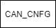
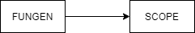
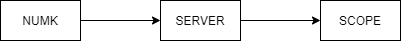
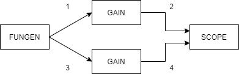
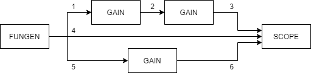
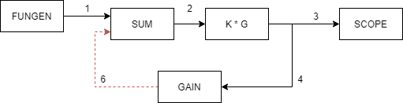

## Posibles arquitecturas de grafos
1. Grafo de un bloque 
 
   
   Este grafo es el que tiene nivel de complejidad más bajo, su nivel de prioridad es ajustable, si se desea ejecutar al final de todo el proceso, como lo es el caso de un log, que guardará datos en un .TXT, o en el caso de una configuracion inicial, como establecer la configuracion de las EPOS.

    <figure align="center">
          
        <figcaption>Fig.1 BLoque encargado de la configuracion CAN.</figcaption>
    </figure>
    

   

2. Grafo de dos bloques

    Uno de los posibles escenarios donde podemos encontar esta topologia es en un modelo de servidor básico, donde enviamos una constante e recibimos un dato que es mostrado en una grafica.

    Antes de graficar el servidor debe tener un dato, y para obtener ese resultado primero debe pedir informacion a algun cliente conectado.

    <figure align="center">
        
        <figcaption>Fig.2 Topologia básica de I/O de un servidor </figcaption>
    </figure>
   

3. Redundancia de conexiones

    Este caso es sencillo de solucionar, antes de encontrar una ruta, se buscan las conexiones redundantes y se combinan en una sóla conexion, para así evitar elecutar las instrucciones de un bloque varias veces por ciclo

    <figure align="center">
        
        <figcaption>Fig.3 Desmultiplexar un vector en sus items y mostrarlos en una gráfica. </figcaption>
    </figure>
   

4. Grafo secuencial de tres bloques 

    En esta configuracion podemos ver varios ejemplos como los de Fig.2, aquí ya podemos ver una dependencia, donde para ejecutar el bloque *SCOPE* es necesario ejecutar primero el bloque *FUNGEN*, ya se crea una **secuencia**.

    <figure align="center">
        
        <figcaption>Fig.4 Topologia básica para mostrar en pantalla una onda generada</figcapton>
    </figure>
   

5. Entradas y salidas compartidas 

   
    Para crear una secuencia correcta debemos cargar primero los bloques fuente, es decir que no poseen entradas, seguidamente escoger cualquier bloque de salida, hasta que exista un requerimiento para retomar el bloque faltante, por ejemplo, usando la imagen de la figura 4, lo correcto es ejecutar el grafo fuente de primer medida, lo que nos libera los caminos 1 y 3, si elejimos el camino 1 debemos seguir con el bloque de ganancia, y tendremos liberado el camino 3, pero como para poder ejecutar el bloque scope precisamos que el camino 4 esté libre, retomamos al camino 3, ejecutando el bloque de gaancia faltante e liberando los dos requisitos para finalmente mostrar en la pantalla nuesras funciones generadas.

    <figure align="center">
        
        <figcaption>Fig.5 Entradas y salidas compartidas entre dos bloques</figcapton>
    </figure>
   

6. Entradas y salidas compartidas 

   
   Similar al caso **5**, manteniendo el mismo algoritmo conseguimos satisfacer este caso, pues sólo con los requerimientos sabemos a donde regresar, y determinar que FUNGEN será el primero en ser ejecutado y SCOPE de ultimo, pues es quien tiene más requerimientos.

    <figure align="center">
        
        <figcaption>Fig.6 Entradas y salidas compartidas entre dos bloques e conexion directa entre ellas </figcapton>
    </figure>
   

7. Loops 

   
   Aunque a simple vista este sea un proceso simple, a niver de ejecucion es un poco más complejo que eso, pues debemos determinar lineas virtuales, tomando como ejemplo la imagen de la figura 6, podemos observar un esquema de control básico, sabemos ya por definicion que necesitamos ejecutar el bloque de referencia de primero, pero al llegar al bloque *SUM*, tenemos un requerimiento sin satisfacer, que es el camino 6, y para liberarlo, debemos ejecutar previamente el bloque *GAIN*, el bloque *K\*G* y el bloque *SUM*, y estariamos repitiendo esto de forma indeterminada, la solucion es convertir un loop en un esquema abierto, sin un requisito, pero sin desligar las relacines, es decir, al momento de encontrar las rutas optimas, se debe hacer de cuenta que el inicio del loop no existe, paro al momento de ejecutar la secuencia esten ligadas las entradas con las salidas.

   Intentemos representar el blucle de una manera más sencilla, haciendo los recorridos anteriores, dando como resultado lo siguiente.

    |  O    |      |   Bloque   |
    |-------|------|------------|
    |   1   |  --> |  FUNGEN    |
    |   2   |  --> |  SUM       |
    |   3   |  --> |  GAIN      |
    |   4   |  --> |  K\*G      |
    |   5   |  --> |   [ 2 - 3 - 4 ] . . .    $\infty$   |  |

    Para dar solucion debemos eliminar la conexion entre los dos primeros bloques del loop, que corresponde a la linea roja de la figura 7, dejando un grafo simple unidireccional.

    <figure align="center">
        
        <figcaption>Fig.7 Esquema de una malla cerrada en control. </figcapton>
    </figure>
   

